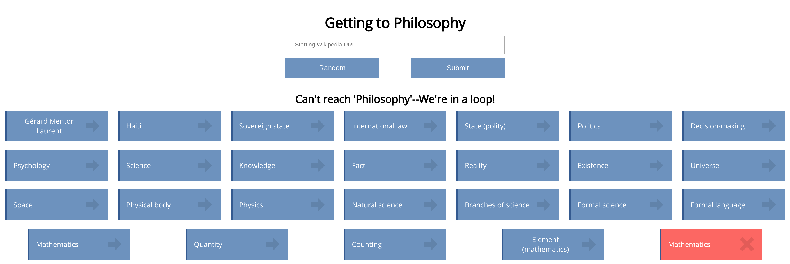

# Path to Philosophy

## Getting Started

This application uses Payara 5.1, MySQL 5.7 and JDK 8. It's been run and tested in Ubuntu 18.04.

To get the project running, we'll set up the MySQL database, configure the Payara server and deploy the application (which has already been built and included in the GitHub repository).

### Prerequisites
1. Install [Payara](https://blog.payara.fish/installing-payara-server-on-ubuntu)

2. Install MySQL 5.7

```
sudo apt-get update
sudo apt-get install mysql-server
```


### Setting up MySQL
We're going to be creating a *philosophy_db* using the provided *bento_philosophy.sql* file.

1. Log in to MySQL database using root.
```
mysql -uroot -p
```

2. Source with provided *bento_philosophy.sql* file.
```
source pathtophilosophy/bento_philosophy.sql
```
3. Create new user and grant privileges for this database.

```
GRANT ALL PRIVILEGES ON *.* TO 'philosophy_db_user'@'localhost' IDENTIFIED BY 'bento1234';
```


### Setting up Payara
1. Start up Payara
```
cd payara5/glasshfish/bin
./asadmin start-domain
```
2. Navigate to localhost:4848 in a browser

3. Create a new JDBC connection pool by navigating on the left hand side to Resources > JDBC > JDBC Connection Pools and clicking "New..."

4. Create pool with the following information:
```
Pool Name: philosophy_db_pool
Resource Type: javax.sql.ConnectionPoolDataSource
Database Driver Vendor: MySql
```

5. Select "Next".

6. Under additional properties, fill out the following information:
```
URL: jdbc:mysql://localhost:3306/philosophy_db
User: philosophy_db_user
Password: bento1234
```

7. Click "Finish".

8. Create a new JDBC Resource by navigating on the left hand side to Resources > JDBC > JDBC Resources and clicking "New..."

9. Create JDBC resource with the following information:
```
JNDI Name: jdbc/philosophy_db
Pool Name: philosophy_db_pool
```

10. Click "OK".


### Deploying the EAR file
1. While you're still in the Payara Server Console (localhost:4848), navigate to the Applications tab.

2. Click "Deploy..."

3. Choose the EAR file from the pathtophilosophy project, located in /pathtophilosophy/pathtophilosophy-ear/target

4. Click "OK". The application should now be deployed.


### Navigating to the project in browser
Navigate to http://localhost:8080/pathtophilosophy-web/ to see the complete project.

